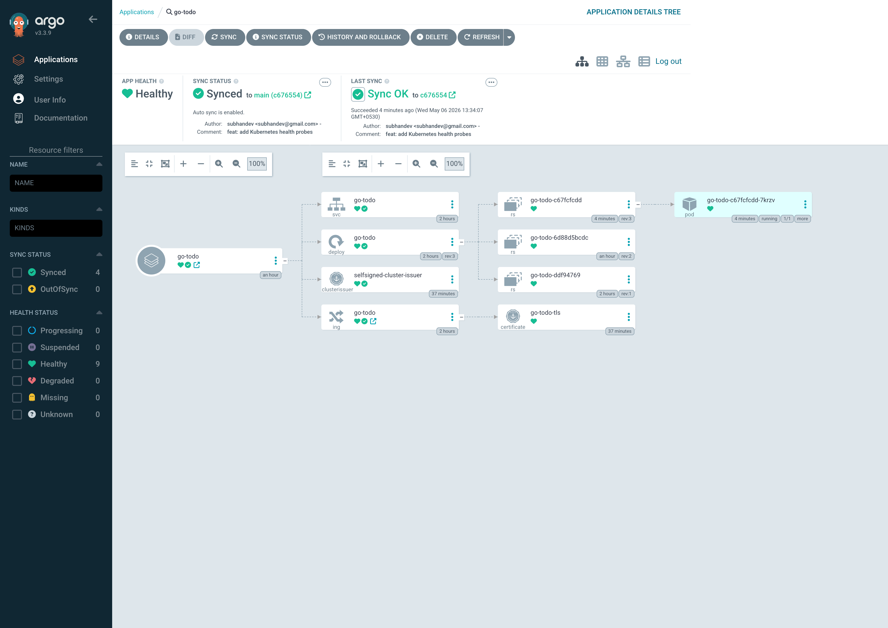
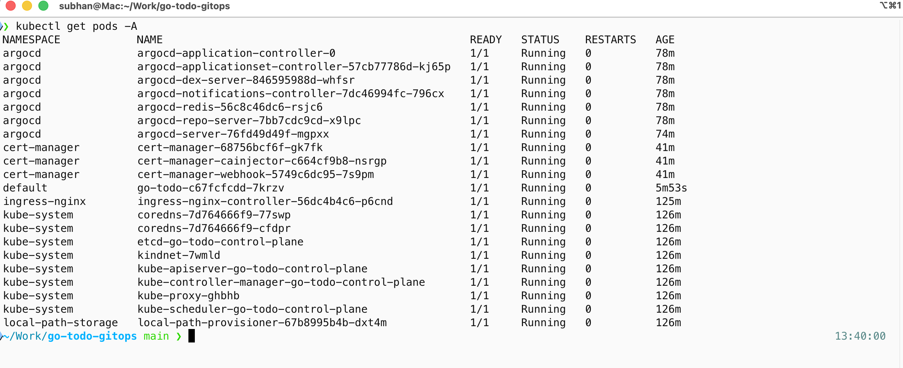
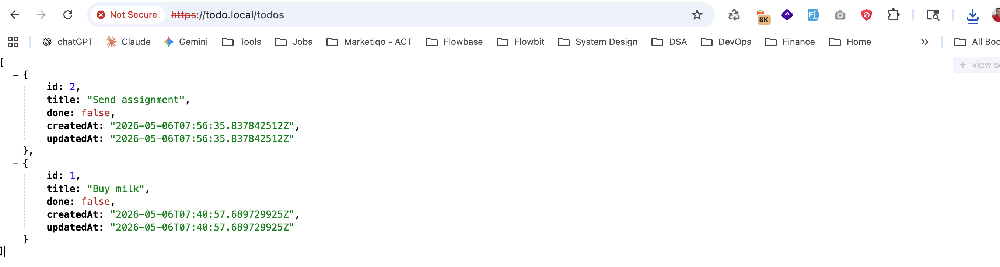
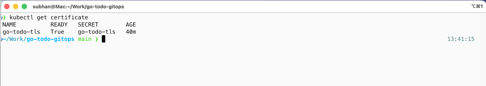

# go-todo-gitops

Production-style Todo API built with Go and deployed to Kubernetes using GitOps with Argo CD and TLS.

## Overview

This project demonstrates an end-to-end modern application deployment workflow:

* Go REST API using Gin
* SQLite persistence with GORM
* Dockerized application
* Kubernetes deployment on KIND
* NGINX Ingress Controller
* GitOps deployment using Argo CD
* Automated TLS certificates using cert-manager

The project is intentionally kept simple while showcasing a production-oriented deployment pipeline.

---

## Architecture

```text
                    GitHub Repository
                             │
                             ▼
                       Argo CD (GitOps)
                             │
                             ▼
                  Kubernetes Cluster (KIND)
                             │
                    NGINX Ingress Controller
                             │
                      TLS via cert-manager
                             │
                             ▼
                       Go Todo API
                             │
                             ▼
                         SQLite DB
```

---

## Tech Stack

| Layer             | Technology    |
| ----------------- | ------------- |
| Backend           | Go + Gin      |
| ORM               | GORM          |
| Database          | SQLite        |
| Containerization  | Docker        |
| Kubernetes        | KIND          |
| GitOps            | Argo CD       |
| Ingress           | ingress-nginx |
| TLS               | cert-manager  |
| Config Management | Kustomize     |

---

## Project Structure

```text
go-todo-gitops/
│
├── app/
│   ├── cmd/
│   │   └── main.go
│   ├── database/
│   ├── handlers/
│   ├── models/
│   ├── routes/
│   └── main.go
│
├── docker/
│   └── Dockerfile
│
├── k8s/
│   ├── base/
│   ├── overlays/
│   └── argocd/
│
├── scripts/
│   └── kind-config.yaml
│
├── Makefile
├── README.md
├── go.mod
└── go.sum
```

---

## Features

### API Endpoints

| Method | Endpoint     | Description   |
| ------ | ------------ | ------------- |
| GET    | `/`          | Root endpoint |
| GET    | `/healthz`   | Health check  |
| GET    | `/todos`     | List todos    |
| GET    | `/todos/:id` | Get todo      |
| POST   | `/todos`     | Create todo   |
| PUT    | `/todos/:id` | Update todo   |
| DELETE | `/todos/:id` | Delete todo   |

---

## Prerequisites

Install the following tools:

* Go 1.25+
* Docker
* kubectl
* KIND
* Git

macOS installation example:

```bash
brew install go
brew install kind
brew install kubectl
```

---

## Local Development

### Run Application

```bash
make run
```

Application runs on:

```text
http://localhost:8080
```

### Run Tests

```bash
make test
```

### Build Application

```bash
make build
```

---

## Docker

### Build Image

```bash
docker build -f docker/Dockerfile -t go-todo:latest .
```

### Run Container

```bash
docker run -p 8080:8080 go-todo:latest
```

---

## Kubernetes Deployment

### Create KIND Cluster

```bash
kind create cluster --name go-todo --config scripts/kind-config.yaml
```

### Install ingress-nginx

```bash
kubectl apply -f https://raw.githubusercontent.com/kubernetes/ingress-nginx/main/deploy/static/provider/kind/deploy.yaml
```

### Install cert-manager

```bash
kubectl apply -f https://github.com/cert-manager/cert-manager/releases/latest/download/cert-manager.yaml
```

### Load Local Docker Image into KIND

```bash
kind load docker-image go-todo:latest --name go-todo
```

### Apply Kubernetes Manifests

```bash
kubectl apply -k k8s/base
```

---

## GitOps with Argo CD

### Install Argo CD

```bash
kubectl create namespace argocd

kubectl apply -n argocd \
  -f https://raw.githubusercontent.com/argoproj/argo-cd/stable/manifests/install.yaml
```

### Apply Argo CD Application

```bash
kubectl apply -f k8s/argocd/application.yaml
```

Argo CD automatically:

* Watches the GitHub repository
* Detects manifest changes
* Synchronizes cluster state
* Self-heals drift

---

## TLS Configuration

TLS is configured using:

* cert-manager
* self-signed ClusterIssuer
* Kubernetes Ingress TLS

Application is available at:

```text
https://todo.local
```

Since this uses a self-signed certificate for local development, the browser will show a security warning. Proceed manually to continue.

For curl requests, use the `-k` flag to allow self-signed certificates.

---

## Hosts File

Add the following entries to `/etc/hosts`:

```text
127.0.0.1 todo.local
127.0.0.1 argocd.local
```

---

## Verification Commands

### Verify Pods

```bash
kubectl get pods
```

### Verify Ingress

```bash
kubectl get ingress
```

### Verify TLS Certificate

```bash
kubectl get certificate
```

### Verify Argo CD Applications

```bash
kubectl get applications -n argocd
```

---

## Example API Usage

### Create Todo

```bash
curl -k -X POST https://todo.local/todos \
  -H "Content-Type: application/json" \
  -d '{"title":"Buy milk","done":false}'
```

### List Todos

```bash
curl -k https://todo.local/todos
```

---

## Screenshots

### ArgoCD GitOps Sync



### Kubernetes Cluster Resources



### HTTPS-enabled Todo API



### TLS Certificate Status



---

## Future Improvements

Potential enhancements:

* PostgreSQL instead of SQLite
* Persistent Volume for database storage
* CI/CD pipeline using GitHub Actions
* Helm chart packaging
* Metrics and monitoring
* Authentication and authorization

---

## Key Learnings

This project demonstrates:

* Containerized Go application development
* Kubernetes deployment fundamentals
* GitOps workflows using Argo CD
* Ingress routing and TLS automation
* Infrastructure-as-code practices
* Declarative Kubernetes resource management

---

## Author

Subhan Ahmed
